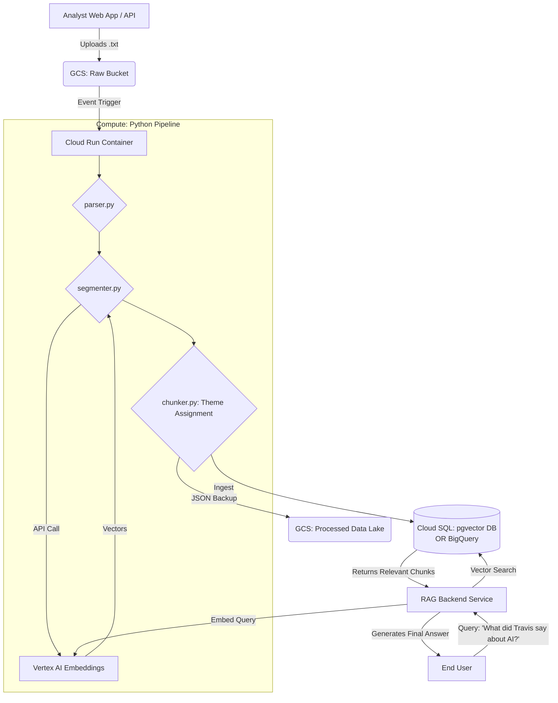

# GCP Architecture Plan: Semantic Chunking & RAG Pipeline

This document maps our locally validated Python pipeline to Google Cloud Platform (GCP). The architecture is designed to remain **cloud-agnostic** at its core (using Docker containers and standard protocols), allowing a lift-and-shift to AWS or Azure later if required.

## 1. Storage Layer

### Raw Transcripts
*   **GCP Service:** Google Cloud Storage (GCS)
*   *AWS Equivalent:* S3
*   **Workflow:** Raw `.txt` transcripts are uploaded into a specific GCS bucket (e.g., `gs://vip-transcripts-raw/`).

### Output Artifacts (JSON Chunks)
*   **GCP Service:** Google Cloud Storage (GCS)
*   **Workflow:** The output of the chunker (the JSON arrays containing the text, themes, and vectors) can be dropped into an output bucket (e.g., `gs://vip-transcripts-processed/`) as a backup layer and data lake source.

## 2. Compute Layer (The Pipeline)

Our core `chunker/` package code requires zero modifications to run in the cloud. We will wrap the package in a Docker container.

*   **GCP Service:** Cloud Run Job (or Cloud Run Service)
*   *AWS Equivalent:* AWS Fargate / Lambda
*   **Trigger Mechanism:** Eventarc. When a new file lands in the raw GCS bucket, it triggers the Cloud Run container to execute the python pipeline on that specific file.
*   **Agnostic Benefit:** By relying on standard Docker containers, you aren't locked into proprietary cloud orchestration.

## 3. Embedding Model Integration

Currently, the `chunker` uses the local `SentenceTransformer` adapter. In the cloud, we will utilize a native serverless embedder.

*   **GCP Service:** Vertex AI Embeddings API (`textembedding-gecko` or newer)
*   *AWS Equivalent:* Amazon Bedrock
*   **Implementation:** We will add a new adapter in `embedders.py` called `VertexAIEmbedder` that adheres to our standard `EmbeddingModel` protocol.

## 4. Vector Database & Output Storage

The chunk JSON output contains the pre-calculated float arrays (embeddings) and metadata (speaker, turn_index, theme). You mentioned the existing AWS setup uses **Aurora**. 

### The Direct Aurora Equivalent: Cloud SQL / AlloyDB
*   **GCP Service:** Cloud SQL for PostgreSQL (or AlloyDB for Enterprise) with the `pgvector` extension.
*   *Why this is the 1:1 match:* Aurora is an operational (OLTP) relational database. Cloud SQL and AlloyDB are GCP's direct counterparts. Using `pgvector` allows you to store your structured metadata alongside the embeddings and perform lightning-fast RAG vector searches.
*   **Agnostic Benefit:** Using Postgres+pgvector means the exact same database schema works on AWS Aurora, GCP Cloud SQL, Azure Database, or your local machine.

### The BigQuery Option (Data Warehouse Layer)
*   **GCP Service:** BigQuery
*   *AWS Equivalent:* Amazon Redshift
*   *When to use BigQuery instead:* If you are moving away from operational "point-lookups" (RAG) and moving toward massive-scale analytics (e.g., "Show me a dashboard of how often Elon Musk discussed Margins vs AI over the last 10 years"). 
*   **Vector Search in BQ:** BigQuery now natively supports `VECTOR_SEARCH()`. You can dump the JSON chunks directly into BigQuery, indexing the embedding float array. However, BigQuery is optimized for massive analytical scans, making it slightly slower/more expensive for high-frequency, low-latency individual RAG query lookups compared to Cloud SQL/Aurora.

**Recommendation:** If the primary goal is a fast RAG chatbot ("What did Travis say about AI?"), stick with **Cloud SQL / AlloyDB (PostgreSQL + pgvector)** to match your existing Aurora logic. If your goal is primarily dashboards, reporting, and theme aggregation across hundreds of transcripts, route the output artifacts directly into **BigQuery**.

## 5. End-to-End Workflow Diagram

## Next Implementation Steps
If we are ready to build this, the required steps are:
1.  **Containerize:** Create a `Dockerfile` for the Python application so it is ready for Cloud Run.
2.  **Add GCP Interface:** Write the `VertexAIEmbedder` inside `embedders.py`.
3.  **Database Connection:** Create an ingestion script that uploads the completed chunks directly to a Postgres `pgvector` table.
